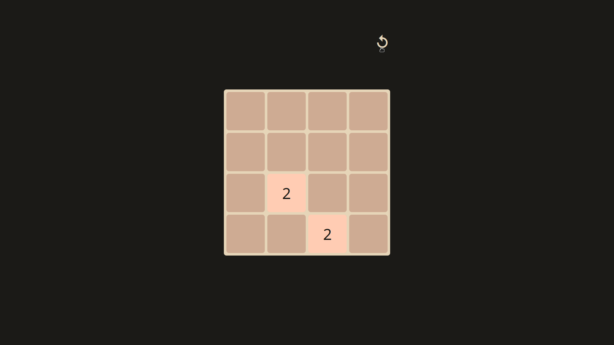
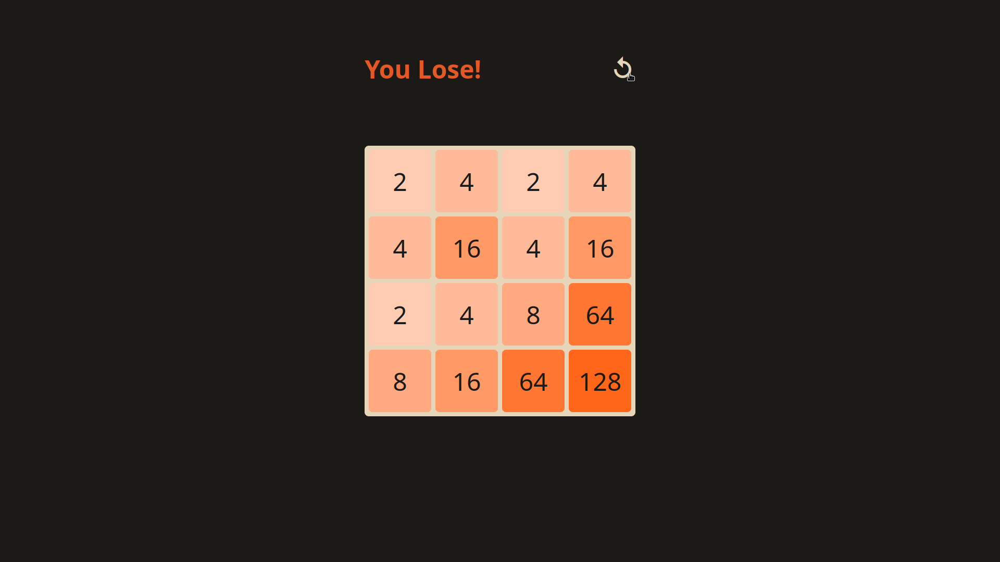

# 2048 Game

This is a simple (rebuilt) 2048 game. I was inspired by [this tutorial](https://www.youtube.com/watch?v=wOVEe9eawXc).

This project is helping me to polish my logic and learn `css` and `js` more.

## Tools:
- HTML 5
- CSS
- Vanilla JS
- [Materialize CSS Icons](https://materializecss.com/icons.html)

## Screenshots:

